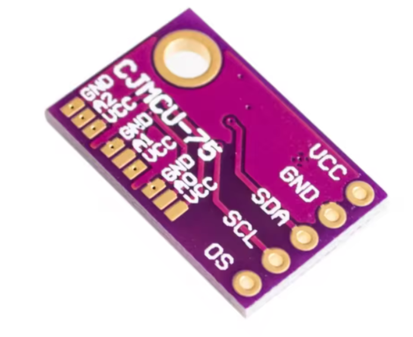
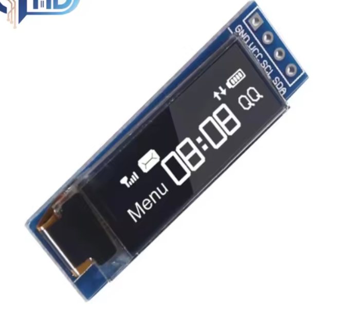
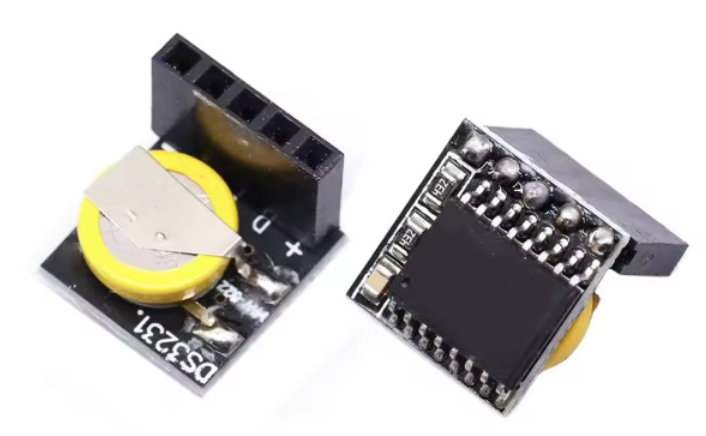
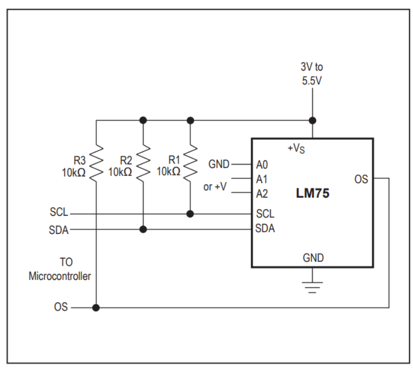
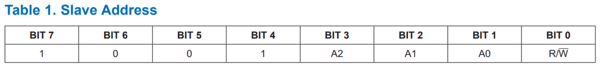
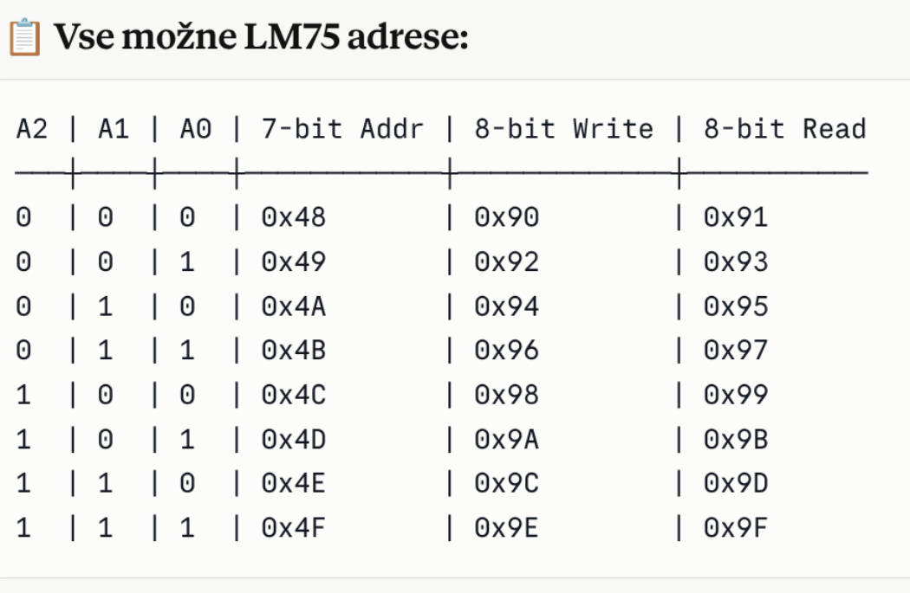
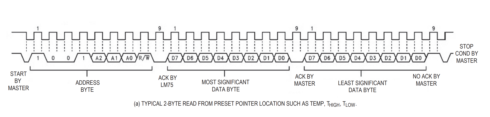

# i2cbus 

Na I2C bus priključimo :
- esp32s3
- temperaturni senzor LM75(WCMCU-75)AHT30
- monitor OLED Display Module SSD1306
- uro DS3231 Clock Module  

  
  
  

## O I2C protokolu

I2C (Inter-Integrated Circuit) je protokol, ki omogoča komunikacijo med napravami preko dveh žic: SDA (Serial Data Line) za prenos podatkov in SCL (Serial Clock Line) za časovno usklajevanje. Ta protokol vključuje tudi povezavo do mase in VCC za napajanje. Uporovniki, običajno med 2.2kΩ do 10kΩ, ohranjajo SDA in SCL v visokem stanju, ko so v mirovanju. Vsaka naprava v mreži potrebuje edinstven naslov, kar omogoča komunikacijo med več napravami z minimalno ožičenjem.

Več na:
- Joplin
- https://www.3dsvet.eu/osnove-komunikacijskega-protokola-i2c/  
- https://www.analog.com/en/resources/technical-articles/i2c-primer-what-is-i2c-part-1.html

## Features - Lasnosti in značilnosti

Esp32s3 
 - ni važno kateri GPIO izberemo za SCL in SDA. Priporočila SCL (9, 22, 16, 6, 2 in za SDA(8, 21, 17, 5, 1)  

Temperaturni senzor LM75
- https://www.analog.com/media/en/technical-documentation/data-sheets/lm75.pdf
  naslov : 

Temperaturni senzor LM75 vključuje delta-sigma analogno-digitalni pretvornik in digitalni detektor previsoke temperature.
Gostitelj lahko kadar koli prek vmesnika I2C povpraša LM75 za odčitavanje temperature. Izhod za previsoko temperaturo z open drain (OS) potegne tok, ko je presežena programabilna temperaturna omejitev. Izhod OS
deluje v dveh načinih: kot primerjalnik ali kot prekinitev. Gostitelj nadzoruje temperaturo, pri kateri se sproži alarm (TOS), in histerezno temperaturo,pod katero alarmni pogoj ni veljaven (THYST).
Gostitelj lahko prebere tudi registra TOS in THYST LM75.

    
    

Potrebno je dati upore in najbolje iste za kompletno vodilo po zgornji shemi ne glede , da ima sam esp32 že nekaj vgrajenega.

Naslov LM75 je nastavljen s tremi pini, da se omogoči delovanje več LM75 na istem vodilu. 
Obvezno moramo pinom A0, A1 in A2 dati vredost 1 ali 0 tako da jih zacinimo na Vcc na desni strani ali GND na levi strani. 

Jaz sem nastavil vse 3 na 0 tako da sem jih zacinil na GND. Naslov senzorja je sedaj 1001000 oziroma **hex 0x48**

        

Nastavitveni časi za i2c protokol

        

## Potek

I2C timing diagram (Branje)
Tipično 2 baytno branje z lokacije prednastavljenega pointerja,  kot so temperatura, temperatura visoka in temperatura nizka.  

        

Potek (brez nastavljanja pointerja):

Master pošlje START
- Pošlje naslov naprave + READ bit

LM75 vrne:
- MSB (prvi byte temperature)
- LSB (drugi byte temperature)

Master pošlje NACK in STOP

Kdaj pointer NI preset?

Če si prej dostopal do drugega registra (npr. THIGH), potem:

pointer kaže tja ❗
če hočeš brati temperaturo, moraš narediti:
START
naslov + WRITE
poslati 0x00 (TEMP register)
REPEATED START
naslov + READ
branje 2 bajtov

Ko master pošlje naslov naprave, pošlje skupaj 8 bitov:

[ 7-bitni naslov ] + [ R/W bit ]
R/W = 0 → WRITE
R/W = 1 → READ

## Hardware Requirements

- ESP32-BOX-3 development board
- AHT21 temperature and humidity sensor connected to:
  - SCL: GPIO40
  - SDA: GPIO41

Povzetek :

- I2C_MASTER_SCL_IO           40      
- I2C_MASTER_SDA_IO           41  
- I2C_MASTER_FREQ_HZ          100000  
- I2C_MASTER_TIMEOUT_MS       1000
- AHT30_I2C_ADDR              0x38 
- AHT30_CMD_INIT              0xBE
- AHT30_CMD_TRIGGER           0xAC 
- AHT30_CMD_SOFT_RESET        0xBA 
- AHT30_MEASUREMENT_DELAY_MS  80  

## Software Requirements

 

## Building and Flashing

1. Set up ESP-IDF environment
2. Navigate to the project directory
3. Configure the project: `idf.py menuconfig`
4. Build the project: `idf.py build`
5. Flash to device: `idf.py flash`
6. Monitor output: `idf.py monitor`

## Usage

The application initializes the display and sensor, then continuously reads and displays temperature and humidity every 2 seconds. If sensor initialization fails, it displays an error message on the screen.

## Components

- `display_manager`: Handles LCD display initialization and brightness control
- `sensor_manager`: Manages AHT21 sensor communication and data reading

## License

[Add license information here]# TermostatBox3
