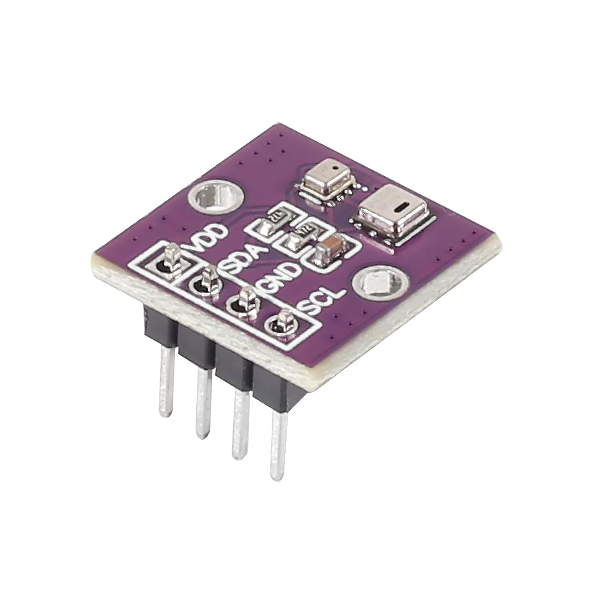
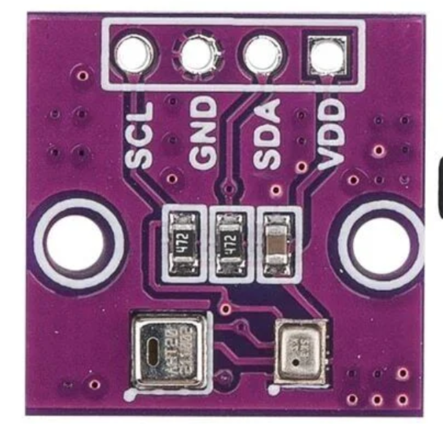
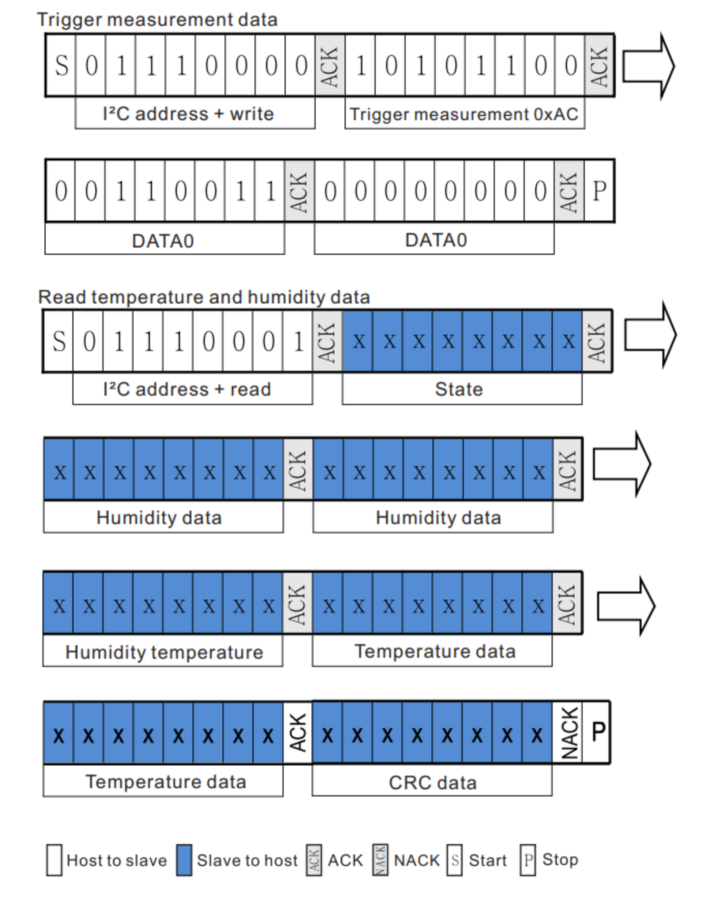

# AHT20
i2c senzor za merjenje temperature in vlage 

  
  

https://github.com/peff74/ESP_AHT20_BMP280
https://files.seeedstudio.com/wiki/Grove-AHT20_I2C_Industrial_Grade_Temperature_and_Humidity_Sensor/AHT20-datasheet-2020-4-16.pdf

## Temperaturni AHT20 temperaturni senzor in senzor merjenja vlage + BMP280 za merjenje zračnega pritiska 

Na PCB modulu sta nameščena dva senzorja AHT20 in BMP280  + 2 upora (472) 4.7kΩ za pullup SDA in SCL.
Večji senzor je AHT20

Značilnosti
 - Odčitava temperaturo in vlažnost iz AHT20
 

## Potek
https://files.seeedstudio.com/wiki/Grove-AHT20_I2C_Industrial_Grade_Temperature_and_Humidity_Sensor/AHT20-datasheet-2020-4-16.pdf

        

Korak	Kaj se zgodi	Kdo	Podatki

i2c_master_transmit(dev, cmd, sizeof(cmd), 100);

- 1	START	Master	
- 2	Pošlje naslov (0x38) + WRITE (0)	Master	0x70
- 3	ACK	Slave	
- 4	Pošlje ukaz 0xAC	Master	0xAC
- 5	ACK	Slave	
- 6	Pošlje parameter 0x33	Master	0x33
- 7	ACK	Slave	
- 8	Pošlje parameter 0x00	Master	0x00
- 9	ACK	Slave	

Pavza 80 ms 

i2c_master_receive(dev, data, 6, 100);

- 1	Pošlje naslov (0x38) + READ (1)	Master	0x71
- 2	ACK	Slave	
- 3	Prebere 6 bajtov	Slave → Master	data[0]..data[5]
- 4	NACK (zadnji bajt)	Master	
- 5	STOP	Master	

# Podrobno obdelano v Joplinu !!!!!!!