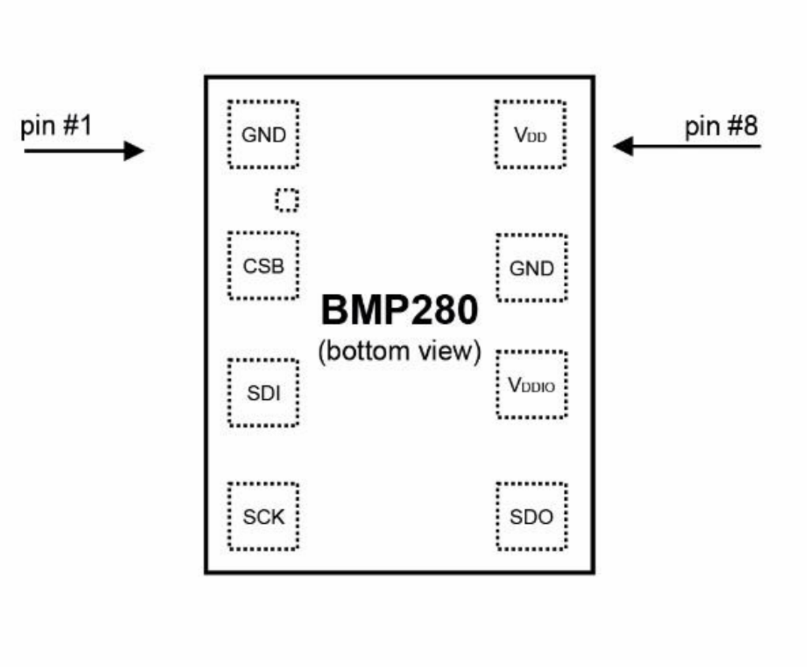
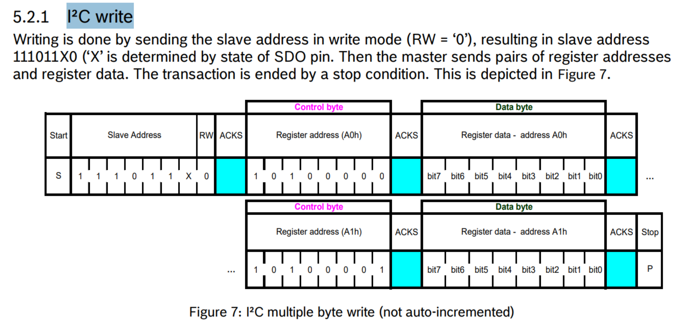
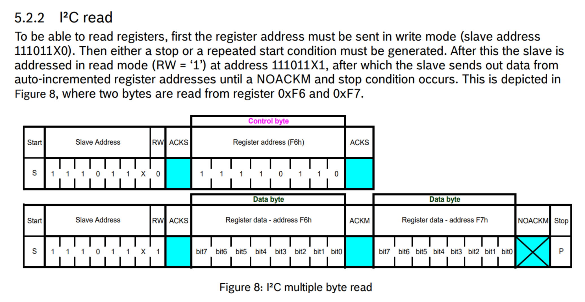

# BMP280

bmp280 je i2c senzor za merjenje temperature in zračnega pritiska 

  
  
  

https://github.com/peff74/ESP_AHT20_BMP280

## BMP280 za merjenje zračnega pritiska 

Na PCB modulu sta nameščena dva senzorja AHT20 in BMP280  + 2 upora (472) 4.7kΩ za pullup SDA in SCL
Manjši senzor je BMP280.
BMP280 podpira I2C in PCI protokol. 

Značilnosti
 - Odčitava temperaturo in tlak iz BMP280
 
Naslov I²C
Ima možnost dveh naslovov. Če je nogica SDO priključena na GND je naslov 0x76 , če je priključena na Vdd je naslov 0x77
Na naši PCB kartici je 0x77 , tako sledi iz primera na na github.

## Potek

https://www.bosch-sensortec.com/media/boschsensortec/downloads/datasheets/bst-bmp280-ds001.pdf

        
        

# Podrobno obdelano v Joplinu !!!!!!!