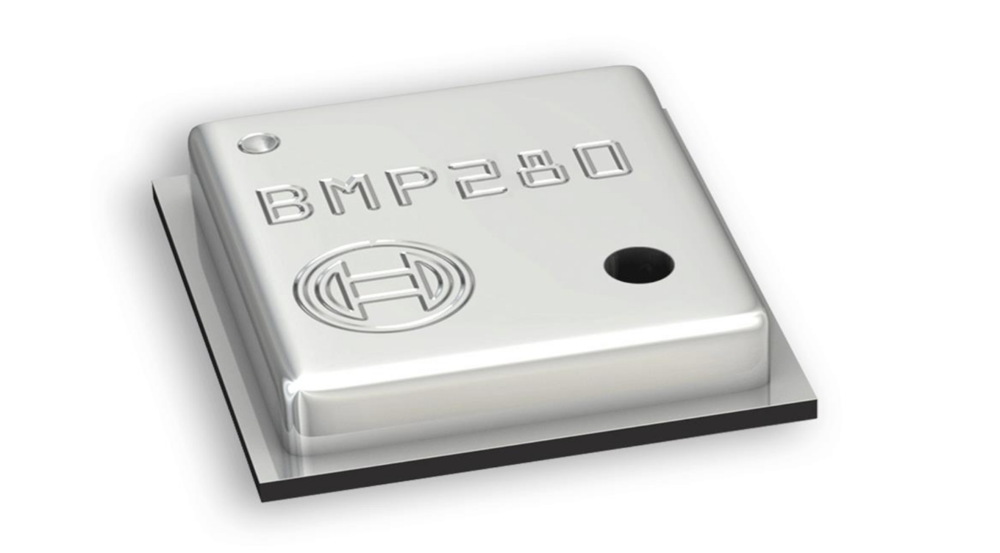

# BMP280

bmp280 je i2c senzor za merjenje temperature in zračnega pritiska 

  
  

https://github.com/peff74/ESP_AHT20_BMP280
https://www.bosch-sensortec.com/media/boschsensortec/downloads/datasheets/bst-bmp280-ds001.pdf

## BMP280 za merjenje zračnega pritiska 

Na PCB modulu sta nameščena dva senzorja AHT20 in BMP280  + 2 upora (472) 4.7kΩ za pullup SDA in SCL
Manjši senzor je BMP280
Značilnosti
 - Odčitava temperaturo in tlak iz BMP280
 
Naslov I²C
 - BMP280	0x77

## Potek

I2C timing diagram (Branje)
Tipično 2 baytno branje z lokacije prednastavljenega pointerja,  kot so temperatura, temperatura visoka in temperatura nizka.  

        

Potek (brez nastavljanja pointerja):

Master pošlje START
- Pošlje naslov naprave + READ bit

LM75 vrne:
- MSB (prvi byte temperature)
- LSB (drugi byte temperature)

Master pošlje NACK in STOP

Kdaj pointer NI preset?

Če si prej dostopal do drugega registra (npr. THIGH), potem:

pointer kaže tja ❗
če hočeš brati temperaturo, moraš narediti:
START
naslov + WRITE
poslati 0x00 (TEMP register)
REPEATED START
naslov + READ
branje 2 bajtov

Ko master pošlje naslov naprave, pošlje skupaj 8 bitov:

[ 7-bitni naslov ] + [ R/W bit ]
R/W = 0 → WRITE
R/W = 1 → READ

        

## Hardware Requirements

- ESP32-BOX-3 development board
- AHT21 temperature and humidity sensor connected to:
  - SCL: GPIO40
  - SDA: GPIO41

Povzetek :

- I2C_MASTER_SCL_IO           40      
- I2C_MASTER_SDA_IO           41  
- I2C_MASTER_FREQ_HZ          100000  
- I2C_MASTER_TIMEOUT_MS       1000
- AHT30_I2C_ADDR              0x38 
- AHT30_CMD_INIT              0xBE
- AHT30_CMD_TRIGGER           0xAC 
- AHT30_CMD_SOFT_RESET        0xBA 
- AHT30_MEASUREMENT_DELAY_MS  80  

## Software Requirements

 

## Building and Flashing

1. Set up ESP-IDF environment
2. Navigate to the project directory
3. Configure the project: `idf.py menuconfig`
4. Build the project: `idf.py build`
5. Flash to device: `idf.py flash`
6. Monitor output: `idf.py monitor`

## Usage

The application initializes the display and sensor, then continuously reads and displays temperature and humidity every 2 seconds. If sensor initialization fails, it displays an error message on the screen.

## Components

- `display_manager`: Handles LCD display initialization and brightness control
- `sensor_manager`: Manages AHT21 sensor communication and data reading

## License

[Add license information here]# TermostatBox3
